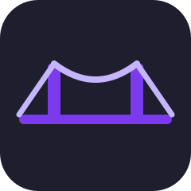
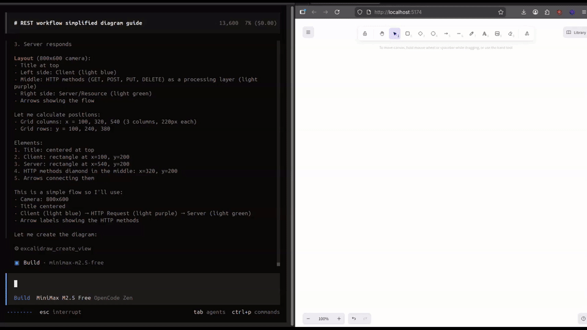

<p align="center">
  
</p>

<h1 align="center">ExcalidrawBridge</h1>

<p align="center">
  Ask your AI to draw something. Watch it appear in your browser, live.
</p>

<p align="center">
  
  
  
  
  
</p>

<p align="center">
  
</p>

---

[excalidraw-mcp-app](https://github.com/antonpk1/excalidraw-mcp-app) is an MCP server that lets AI draw Excalidraw diagrams. The problem is running it locally isn't well documented - the official setup pushes you toward their hosted version, which requires a paid plan and a packaged extension. Since the project is open source, we forked it and wrapped it with a proper local setup.

ExcalidrawBridge is just a thin wrapper around that fork. It adds a browser canvas and wires everything up so you can run the whole thing locally with one command. The MCP server itself (streaming, checkpoints, tools, animations) is entirely Anton's work.

## What the wrapper adds

- A browser canvas at `localhost:5173` that receives diagrams via WebSocket in real time
- `npm run init` to install everything and wire up the MCP server to your editor
- Supports 7 editors out of the box: Claude Code, Claude Desktop, VS Code, Cursor, Windsurf, Codex, OpenCode
- Edit the diagram directly in the browser, changes sync back to the AI
- Export to excalidraw.com with one click

## Requirements

- Node >= 18
- [bun](https://bun.sh)
- [pnpm](https://pnpm.io)

## Install

**One-shot** (clones + sets everything up):

```bash
curl -fsSL https://raw.githubusercontent.com/benounnas/ExcalidrawBridge/refs/heads/main/install.sh | sh
```

**Manual:**

```bash
git clone https://github.com/benounnas/excalidraw-suite excalidrawbridge
cd excalidrawbridge
npm run init
```

`npm run init` installs deps, builds the MCP server, and walks you through registering it with your editor(s).

## Usage

```bash
npm run dev
```

Opens (ports based on your `.env`, defaults below):
- Canvas: `http://localhost:5173`
- MCP server: `http://localhost:9821/mcp`
- WebSocket: `ws://localhost:9822`

Then go to your AI client and ask it to draw something. The diagram will appear in the browser.

## Supported editors

`npm run init` handles registration for all of these:

| Editor | How |
|--------|-----|
| Claude Code | `claude mcp add --scope user` |
| Claude Desktop | config JSON |
| VS Code / Copilot | `.vscode/mcp.json` |
| Cursor | `~/.cursor/mcp.json` |
| Windsurf | `~/.codeium/windsurf/mcp_config.json` |
| Codex | `~/.codex/config.toml` |
| OpenCode | `~/.config/opencode/opencode.json` |

## How it works

```
AI client  →  MCP server  →  WebSocket  →  Browser canvas
              (stdio/HTTP)    (port 9822)    (Excalidraw)
```

1. You ask the AI to draw something
2. The AI calls `create_view` on the MCP server with Excalidraw JSON elements
3. The MCP server broadcasts them over WebSocket
4. The browser canvas receives and renders them live
5. If you edit the diagram, the changes get sent back to the AI's context

The MCP server runs dual-mode: stdio for local editors, HTTP for stateless connections. If multiple MCP instances try to bind the same WebSocket port, they automatically forward through the first one.

## Examples

See the [examples gallery](examples/) for prompts you can try. Each one includes the prompt text and the resulting `.excalidraw` file.

| Example | Description |
|---------|-------------|
| [OAuth 2.0 Flow](examples/01-oauth-flow.md) | Sequence diagram with 4 lanes and 7 steps |
| [CI/CD Pipeline](examples/02-cicd-pipeline.md) | Left-to-right pipeline with decision loop |

For best results, prepend the [Recommended Prompt](RECOMMENDED-PROMPT.md) before your drawing request. It teaches the model spacing, sizing, and layout rules that prevent overlapping elements.

## Configuration

All ports are read from `.env`. The values below are the defaults:

```env
PORT=9821     # MCP server port
WS_PORT=9822  # WebSocket port
```

Change them if you have conflicts. Everything picks them up automatically.

## Run parts individually

```bash
# Just the canvas
cd client-app && bun run dev

# Just the MCP server (HTTP)
cd excalidraw-mcp && pnpm run dev

# MCP server in stdio mode (Claude Desktop)
node excalidraw-mcp/dist/index.js --stdio
```

## Project layout

```
excalidrawbridge/
├── client-app/          React + Excalidraw canvas
├── excalidraw-mcp/      MCP server (upstream, slightly extended)
├── examples/            Prompts and .excalidraw outputs
│   └── excalidraw-jsons/
├── cli.mjs              init + dev commands
├── setup.mjs            editor registration wizard
├── install.sh           one-shot install script
├── RECOMMENDED-PROMPT.md  layout rules for AI prompts
└── .env                 port config
```

## Credits

The MCP server is [excalidraw-mcp-app](https://github.com/antonpk1/excalidraw-mcp-app) by [Anton Pidkuiko](https://github.com/antonpk1). ExcalidrawBridge adds the browser canvas, WebSocket layer, and local setup tooling around it.

## License

MIT
